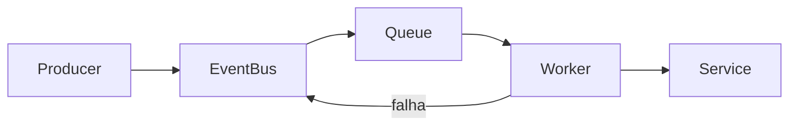

<div align="center">
    <h1>
        EventChaos
    </h1>
  
O projeto simula múltiplos serviços processando eventos com falhas aleatórias, retries com backoff exponencial e coleta de métricas em tempo real.
A proposta é reproduzir de forma simplificada comportamentos comuns em sistemas event-driven utilizados em produção, como Kafka e RabbitMQ.
</div>


---

## Arquitetura



---

## Como funciona

1. Um **Producer** gera eventos de forma contínua e aleatória
2. Os eventos são publicados no **EventBus**
3. O EventBus distribui os eventos para filas específicas por tipo
4. **Workers** consomem essas filas de forma concorrente
5. Cada Worker executa um **Service (handler)**
6. Em caso de falha:

   * O evento é reprocessado (retry com backoff exponencial)
   * Após o limite de tentativas, é enviado para um evento de falha (Dead Letter)
7. O sistema coleta métricas e logs durante toda a execução

---

## Funcionalidades

* Arquitetura orientada a eventos
* Processamento concorrente com threads
* Retry com backoff exponencial
* Dead Letter Queue (DLQ)
* Idempotência de eventos
* Dashboard em tempo real no terminal
* Logging em arquivo (ex: `app_24-03-2026_22-44-26.log`) e console

---

## Estrutura do projeto

```text
app/        → inicialização da aplicação e geração de carga
events/     → definição dos eventos
services/   → lógica de processamento dos eventos
infra/      → infraestrutura (event bus, workers, métricas, logging)
```

---

## Como executar

```bash
python main.py
```

---

## Configuração do teste

Você pode controlar a duração da simulação no `main.py`:

```python
generate_load(bus, duration=20)
```

---

## Exemplo de saída

```text
=== SYSTEM DASHBOARD ===

Processed: 120
Failed: 5
Retries: 38

Per Worker:
- NotificationWorker: 45 processed / 0 failed / 3 retries
- PaymentWorker: 25 processed / 0 failed / 8 retries     
- EmailWorker: 13 processed / 1 failed / 6 retries       
- MessageWorker: 32 processed / 4 failed / 21 retries    
- DeadLetterWorker: 5 processed / 0 failed / 0 retries
```

---
